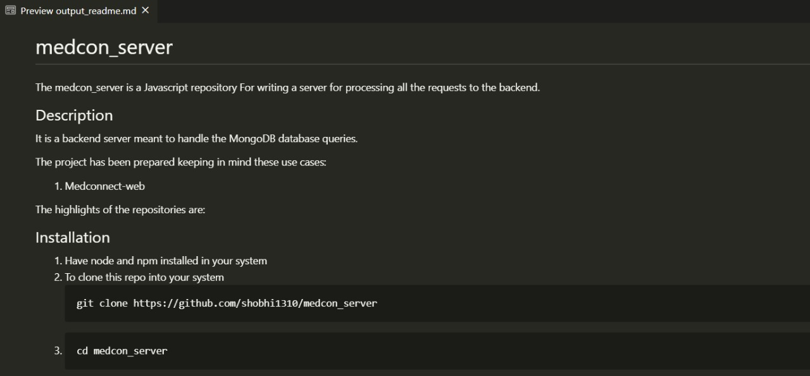

# readme-toolkit
The readme-toolkit is a Python repository for generating a readme of a repository.

## Description
There is always a tension among the users for writing a flawless readme and it is also very cumbersome to do the documentation in the last moment. This repository has also been made using this toolkit itself.

The project has been prepared keeping in mind these use cases:

1. For people who are new to `readme.md`
2. For people who write in the last moment
3. People with less vocabulary

 The highlights of the repositories are:

1. AST is used for finding out the most frequently used custom function
2. Dependency is listed for some supported languages (javascript as of now)
3. Neat framing of readme is provided as an output
## Installation
1. for cloning the repository
	```
	git clone https://github.com/tapish2000/readme-toolkit.git
	```
2. 	```
	cd readme-toolkit
	```

## Usage
1. Have `beautiful-soup` and `request` installed in your system using `pip`
2. In the executing directory, type this command for invoking the interactive CLI.
	```
	make
	```
## Output
- output_readme.md
- dependency.txt
- data.json

## Sample Input
```
Enter the Repository Link: https://github.com/shobhi1310/medcon_server
What is the major language used in the repository: Javascript
What is the purpose of the repository [eg: for timepass]: For writing a server for processing all the requests to the backend
Do you want to add installation steps in the README [y/n]: y
Write the installation of steps [type 'quit' to stop entering]:
>> Code:
>> Description of Code: Have node and npm installed in your system
>> Code: git clone https://github.com/shobhi1310/medcon_server
>> Description of Code: To clone this repo into your system
>> Code: cd medcon_server
>> Description of Code:
>> Code: npm install
>> Description of Code: quit
Do you wish to describe about your repository [y/n]: y
What major issue does your project solve: It is a backend server meant to handle the MongoDB database queries.
What are the use cases of this project [type "quit" to stop entering or keep writing ]:
1. Medconnect-web
2. quit
Unique ideas in this project which is worth mentioning [type "quit" to stop entering or keep writing ]:
1.  quit
Write the steps to use your project [type 'quit' to stop entering]:
>> Code: quit
>> Description of Code: quit
Link to any personal dev blog/website [optional]:
Acknowledge people who helped you in your project [type "quit" to stop entering or keep writing ]:
1. [Name, Blog page/site link]: Tapish, https://github.com/tapish2000
2. [Name, Blog page/site link]: quit
```
## Sample output for given sample input


As of now the meta-data is not linked into the output readme and will be integrated in release 2.0, though they are collected and stored.

## Authors and Acknowledgment
The author of this repository is Tapish Ojha. Explore more about the author and find related things [here](https://github.com/tapish2000). This project has also been possible due to contribution of these people: 
1. [Shubhankar Bhadra](https://github.com/shobhi1310)
## Contributing
First fork this repo then clone it into your system. Pull requests are welcome. For major changes, please open an issue first to discuss what you would like to change.


<!--- # for title--->
<!--- ## for h1--->
<!--- 1. for numberred bullet--->
<!--- - for bullet--->
<!---  [name](site link) for using as hyperlink--->
<!---  for displaying image--->
